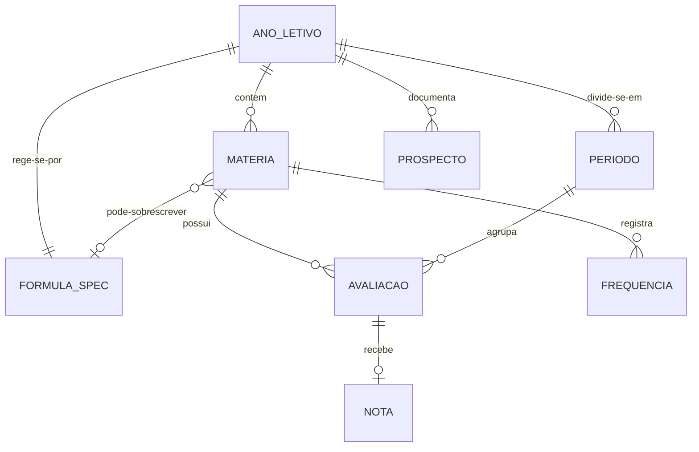

# Arquitetura — App de Notas Escolares

> Documento vivo. Versão 0.2 — stack pivotada para React Native (ver
> [ADR 0004](adr/0004-pivo-react-native.md)); arquitetura ainda anterior à
> definição da fórmula de cálculo.

## 1. Escopo

Aplicativo mobile (iOS + Android) que permite ao aluno:

1. Cadastrar as **matérias** que terá no ano letivo.
2. Registrar **notas e avaliações** ao longo dos períodos (bimestres/trimestres).
3. Calcular médias, situação (aprovado / recuperação / reprovado) e **quanto falta
   tirar para passar**, segundo uma **fórmula fornecida posteriormente**.
4. Armazenar o **prospecto** (documento de regras da escola) no aparelho.
5. Preservar **tudo que já foi digitado**, localmente, sem depender de rede ou conta.

### Não-escopo (v1)

Backend, login, sincronização entre dispositivos, integração com sistema da escola,
compartilhamento social, notificações push.

## 2. Restrições que moldam a arquitetura

| # | Restrição | Consequência arquitetural |
|---|---|---|
| R1 | A fórmula de cálculo **ainda não existe** | O cálculo não pode estar codificado. Vira um **motor genérico** que interpreta uma especificação declarativa versionada (ver `MOTOR-DE-FORMULA.md`). |
| R2 | Dados ficam **na memória do aparelho** | Persistência local relacional (SQLite), offline-first, sem servidor. |
| R3 | "Valores já inputados" precisam sobreviver | Gravação **write-through com debounce**: cada campo é persistido ao ser digitado, não ao final do formulário. |
| R4 | O **prospecto** é um documento | Arquivo copiado para o container do app + metadados no banco. Caminho **relativo**, nunca absoluto. |
| R5 | Duas plataformas, equipe pequena | Base de código única. O motor de fórmula é escrito **uma vez** e é idêntico nas duas plataformas — requisito crítico de correção. |

## 3. Decisão de stack

**React Native + Expo (managed workflow)** — ver
[ADR 0004](adr/0004-pivo-react-native.md) (substitui a ADR 0001, que escolhia
Flutter).

| Opção | Prós | Contras | Veredito |
|---|---|---|---|
| **React Native + Expo** | Uma base de código; motor de fórmula em TS puro, idêntico nas duas plataformas; pool de contratação maior (JS/TS); OTA update via EAS sem review de loja | Drizzle/`expo-sqlite` é combinação mais jovem que Drift; managed workflow tem menos controle nativo direto | ✅ **Escolhido** |
| Flutter | Drift é mais maduro; Dart tem `Decimal` de primeira classe | Pool de contratação menor | Descartado (era a escolha anterior, ver ADR 0001) |
| Kotlin Multiplatform + Compose/SwiftUI | UI 100% nativa; lógica compartilhada em Kotlin | Custo de duas UIs; dobra o trabalho num app que é essencialmente formulário + tabela | Overkill para v1 |
| Nativo x2 | Melhor UX possível | Duas implementações da fórmula = duas fontes de bug | ❌ |

**Bibliotecas principais**

| Camada | Escolha | Motivo |
|---|---|---|
| Estado / DI | `@reduxjs/toolkit` | Reducers puros testáveis fora da árvore de componentes; escolha do time |
| Persistência | `drizzle-orm` sobre `expo-sqlite` | Queries tipadas verificadas contra o schema, migrações versionadas e testáveis via `drizzle-kit` |
| Modelos | Interfaces TypeScript + `zod` | Tipagem estática, validação em runtime nos limites (import de spec, formulários) |
| Navegação | `expo-router` | Deep link e restauração de estado |
| Expressões | `jsep` (parser JS) + whitelist própria | Avalia a fórmula sem `eval`, sem execução de código arbitrário |
| Arquivos | `expo-document-picker`, `expo-file-system`, `expo-sharing` | Importar o prospecto e exportar backup |
| Segredos | `expo-secure-store` | Só se houver algum dado sensível futuramente |

## 4. Camadas

```
┌─────────────────────────────────────────────────────────┐
│  PRESENTATION                                           │
│  Screens (Expo Router) ─ Componentes ─ Slices (Redux)   │
│  Só conhece: ViewModels + UseCases                      │
├─────────────────────────────────────────────────────────┤
│  DOMAIN  (TypeScript puro — zero import de RN/SQLite)   │
│  Entidades ─ UseCases ─ Interfaces de Repositório       │
│  MotorDeCalculo ─ SolverDeMetas ─ Validadores           │
├─────────────────────────────────────────────────────────┤
│  DATA                                                   │
│  Implementações de Repositório ─ Queries (Drizzle)      │
│  DocumentStore (prospecto) ─ Mappers ─ Migrações        │
├─────────────────────────────────────────────────────────┤
│  PLATFORM                                               │
│  expo-sqlite ─ expo-file-system ─ AsyncStorage ─ expo-document-picker │
└─────────────────────────────────────────────────────────┘
```

Regra de dependência: as setas apontam **sempre para dentro**. `domain` não importa nada
das camadas de fora. Isso é o que permite testar toda a regra de nota sem simulador.

```
app/                      # Expo Router: rotas, layout, bootstrap (fica na raiz,
│                         #   é onde o `expo-router/entry` procura as rotas)
assets/                   # imagens do app; assets/brand/ guarda a arte-fonte
specs/                    # FormulaSpec: schema, exemplos e testes-golden
src/
├── domain/
│   ├── entities/         # AnoLetivo, Materia, Periodo, Avaliacao, Nota, Prospecto
│   ├── formula/          # FormulaSpec, MotorDeCalculo, GoalSolver, Escala
│   ├── repositories/     # interfaces (TypeScript interface)
│   └── usecases/
├── data/
│   ├── local/db/         # Drizzle: schema, queries, migrations
│   ├── local/files/      # DocumentStore
│   ├── repositories/     # implementações
│   └── mappers/
└── presentation/
    ├── features/         # anoLetivo/ materias/ notas/ simulador/ prospecto/ ajustes/
    │                      #   cada feature: componentes + slice Redux
    ├── store/            # store Redux e slices
    └── shared/            # o que atravessa features
        ├── components/
        ├── hooks/
        └── theme.ts
```

Hook usado por mais de uma feature (ou por nenhuma em especial) mora em
`shared/hooks/`; hook que só existe para uma feature mora junto dela.

## 5. Modelo de domínio



| Entidade | Campos principais | Observações |
|---|---|---|
| `AnoLetivo` | `id`, `rotulo` (2026), `escola`, `serie`, `inicio`, `fim`, `formulaSpecId`, `ativo` | Raiz de agregação. Permite guardar anos anteriores. |
| `Periodo` | `id`, `anoLetivoId`, `ordem`, `nome` (1º Bimestre), `inicio`, `fim` | Quantidade e tipo vêm da `FormulaSpec`. |
| `Materia` | `id`, `anoLetivoId`, `nome`, `professor`, `cor`, `cargaHoraria`, `formulaSpecIdOverride`, `arquivada` | **Entrada obrigatória do usuário no onboarding.** |
| `Avaliacao` | `id`, `materiaId`, `periodoId`, `titulo`, `tipoId` (prova/trabalho/…), `peso`, `notaMaxima`, `data`, `obrigatoria` | Os *tipos* e *pesos* padrão vêm da `FormulaSpec`. |
| `Nota` | `id`, `avaliacaoId`, `valor` (`Decimal`, nunca `double` para armazenar), `origem` (real \| simulada), `atualizadoEm` | `origem = simulada` alimenta o simulador sem sujar o histórico. |
| `Frequencia` | `materiaId`, `periodoId`, `faltas`, `aulasPrevistas` | Muitas escolas reprovam por falta; a fórmula precisa desse dado disponível. |
| `FormulaSpec` | `id`, `versao`, `nome`, `json`, `hash`, `criadoEm` | **Imutável.** Alterar = criar nova versão. |
| `ResultadoCalculado` | `materiaId`, `periodoId?`, `media`, `situacao`, `formulaSpecId`, `formulaVersao`, `calculadoEm` | Cache derivado; sempre recomputável. Guarda a versão usada → reprodutibilidade. |
| `Prospecto` | `id`, `anoLetivoId`, `titulo`, `caminhoRelativo`, `mimeType`, `tamanho`, `hash`, `importadoEm` | Ver §7. |
| `Rascunho` | `chave`, `payloadJson`, `atualizadoEm` | Estado de formulário em edição (R3). |

**Dinheiro-e-nota nunca em `number`.** Notas são armazenadas como inteiro escalado
(`valor_milis INTEGER`, ex.: 8.75 → 8750) e manipuladas via `Decimal` (`decimal.js`)
no domínio. Arredondamento é decidido pela `FormulaSpec`, não pelo runtime.

## 6. Persistência dos valores já digitados (R3)

Três níveis, do mais volátil ao mais durável:

```
Digitação ──debounce 300ms──▶ RascunhoRepository (tabela `rascunho`)
    │
    └──ao validar/blur──▶ Repositório da entidade (tabela definitiva)
                                    │
                                    └──▶ invalidação do ResultadoCalculado
```

- **`useAutoSave`**: hook + slice Redux genérico que recebe um `chave → payload`,
  aplica debounce e grava via thunk. Cancelado corretamente no `useEffect` cleanup.
- **Ciclo de vida**: listener de `AppState` (React Native) força *flush* imediato em
  `background`/`inactive` — no iOS esse é o último momento garantido antes de o app ser
  encerrado pelo sistema.
- **Restauração**: ao abrir uma tela, o slice carrega o rascunho antes de
  renderizar; se existir rascunho mais recente que a entidade, oferece "continuar de onde parou".
- **Transações**: toda escrita que toca mais de uma tabela roda dentro de
  `db.transaction()` do Drizzle, garantindo atomicidade se o app morrer no meio.

### Localização física dos dados

| Plataforma | Caminho | Backup |
|---|---|---|
| iOS | `Library/Application Support/notas.db` | Entra no backup do iCloud (desejado). Não usar `Caches/` — o SO apaga. |
| Android | `getDatabasesPath()/notas.db` | Auto Backup habilitado com `data_extraction_rules.xml` explícito |

**iOS — proteção de dados**: definir `NSFileProtectionCompleteUntilFirstUserAuthentication`
no arquivo do banco. `Complete` quebraria qualquer acesso em background.

## 7. Prospecto (documento da escola)

Fluxo de importação:

```
Usuário toca "Importar prospecto"
  → expo-document-picker (UIDocumentPickerViewController / Storage Access Framework)
  → COPIAR o arquivo para  FileSystem.documentDirectory + prospectos/<uuid>.<ext>
  → calcular SHA-256 (deduplicação)
  → gravar metadados na tabela `prospecto` com CAMINHO RELATIVO
  → (opcional) extrair texto para busca
```

Três armadilhas tratadas explicitamente:

1. **Nunca guardar o caminho absoluto.** O container do app iOS tem UUID que muda entre
   instalações e atualizações; um caminho absoluto salvo hoje aponta para o nada amanhã.
   Guardamos `prospectos/<uuid>.pdf` e resolvemos com `FileSystem.documentDirectory`
   (`expo-file-system`) a cada uso.
2. **Nunca referenciar o arquivo original.** A URL devolvida pelo picker é temporária e
   com escopo de segurança. Copiamos para dentro do container imediatamente.
3. **Limite de tamanho** (sugerido 25 MB) e verificação de MIME — PDF, JPEG, PNG, HEIC.

Fase 2 (quando a fórmula existir): o prospecto vira a *fonte* de onde a `FormulaSpec`
é derivada — parsing assistido do texto para pré-preencher pesos e critérios, sempre
com confirmação do usuário.

## 8. Motor de cálculo

Resumo aqui; detalhamento completo em [`MOTOR-DE-FORMULA.md`](./MOTOR-DE-FORMULA.md).

```
FormulaSpec (JSON validado por schema)
        │
        ▼
   Parser ──▶ AST ──▶ Validador (whitelist de funções e variáveis)
        │
        ▼
   MotorDeCalculo.avaliar(contexto) ──▶ ResultadoCalculado
        │
        └──▶ GoalSolver.quantoPrecisoTirar(alvo) ──▶ nota mínima necessária
```

Duas garantias de projeto:

- **`FormulaSpec` é imutável e versionada.** Todo `ResultadoCalculado` guarda qual
  versão o gerou. Se a escola mudar a regra em julho, as médias do 1º bimestre
  continuam explicáveis.
- **`GoalSolver` não inverte a fórmula algebricamente.** Ele faz *bisseção numérica*
  sobre a variável-alvo dentro da escala válida. Funciona para qualquer fórmula
  monotônica, inclusive as com `if`, `max()` e recuperação — que é justamente onde
  a inversão algébrica quebraria.

O app roda com a fórmula real (`specs/formula-real-trimestral.json`) ativa.

## 9. Telas (v1)

| Tela | Função |
|---|---|
| Onboarding | Ano letivo → tipo de período → **cadastro das matérias** → importar prospecto (opcional) |
| Início | Cartões por matéria: média atual, situação, "faltam X,X" |
| Matéria | Lista de avaliações e notas por período; edição inline com autosave |
| Simulador | Alterar/inserir notas hipotéticas e ver o impacto sem gravar como reais |
| Prospecto | Visualizar o documento importado |
| Ajustes | Fórmula em uso, exportar/importar backup, apagar dados |

## 10. Testes

| Nível | Alvo | Ferramenta |
|---|---|---|
| Unitário (maioria) | `MotorDeCalculo`, `GoalSolver`, arredondamento, validadores | Jest |
| Golden de fórmula | Tabela caso→resultado esperado por `FormulaSpec` | Jest + fixtures JSON |
| Migração | v(n) → v(n+1) com banco populado | `drizzle-kit` + banco `expo-sqlite` em memória |
| Componente | Formulários e autosave (incl. matar o app no meio) | React Native Testing Library |
| Integração | Fluxos ponta a ponta em device | Detox ou Maestro |

Meta: **>90% de cobertura na camada `domain/formula`**. É a única parte do app onde um
bug significa dizer ao aluno que ele passou quando não passou.

## 11. Especificidades de plataforma

### iOS
- `PrivacyInfo.xcprivacy` obrigatório — declarar uso de `UserDefaults` (motivo `CA92.1`) e File Timestamp APIs.
- Como não há coleta de dados: *App Privacy* na App Store Connect = "Data Not Collected". Sem ATT.
- Suporte a Dynamic Type e VoiceOver desde a v1 (motivo comum de review negativo em apps educacionais).
- `NSFileProtectionCompleteUntilFirstUserAuthentication` no banco.
- Mínimo: iOS 15.

### Android
- `data_extraction_rules.xml` + `full_backup_content` explícitos (Android 12+).
- Sem permissões perigosas: o SAF cobre a importação do prospecto sem `READ_EXTERNAL_STORAGE`.
- Data Safety form coerente com "nenhum dado sai do dispositivo".
- `minSdk 24`, `targetSdk` mais recente exigido pela Play.

## 12. CI/CD

GitHub Actions: `lint` (ESLint/TypeScript) + `test` (Jest) em todo PR.
Build e assinatura: EAS Build; publicação: EAS Submit (fase 2).
Correções de JS sem código nativo podem sair via EAS Update (OTA), sem review de loja.
Branches: `main` protegida, trabalho em `feat/*`, merge por PR.

## 13. Riscos abertos

| Risco | Mitigação |
|---|---|
| A fórmula real pode exigir construções que a spec atual não cobre (ex.: descarte da menor nota, média móvel) | Schema extensível + versionamento da própria linguagem (`schemaVersion`); revisão do motor assim que a fórmula chegar |
| Aluno perde o aparelho e perde tudo (sem nuvem) | Exportação/importação de backup JSON na v1; iCloud/Drive na v2 |
| Escolas diferentes, regras diferentes | `FormulaSpec` por ano letivo, com override opcional por matéria |
| Divergência de arredondamento entre plataformas | Aritmética decimal escalada + goldens rodando em CI nas duas plataformas |
